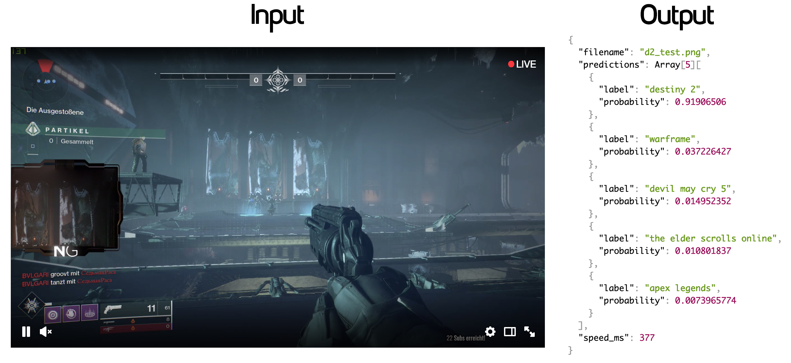

# gamedetect

<p align="center">
    
</p>

gamedetect is a simple API that uses a trained neural network to identify games that are within the top 100 currently on Twitch (as of March 2019). The full list of supported games can be seen [here](graph/output_labels.txt). The network is trained using [retrain.py](https://github.com/tensorflow/hub/blob/master/examples/image_retraining/retrain.py) which uses InceptionV3 as a pre-trained network. Honestly I'm still at the point where I have no idea what the hell I'm talking about so please bear with me.

## Try this...

Start a container with the gamedetect API running by running

```bash
docker run -e DEMO=true -p 8080:8080 s32x/gamedetect
```
(Navigating to `http://localhost:8080` will provide a visual demonstration)

Then, send a POST request with a (relatively clear) game screenshot (one in the supported list) in the "image" field of a form to localhost:8080.

```bash
curl -X POST http://localhost:8080 -F image=@MY_GAME_SCREENSHOT.png
```

Excited yet? I sure am! gamedetect is a fun project I've been playing with in my free time to learn about Computer Vision, Neural Networks, and Tensorflow. It's sort of my own hello world app that also could potentially serve a real use-case on Twitch or any other streaming platform that requires broadcasters to categorize their stream. That being said, I'm still very much a beginner to all of this and I'm sure I'm doing a number of things wrong - feel free to let me know in the issues if you'd like.

NOTE: The public API is currently just for demonstration purposes. It's recommended to utilize the below Docker image if you're interested in higher performance on your own machine/s.

### Running with Docker
To start using gamedetect via Docker, install Docker and run `docker run`:
```
docker run -p 8080:8080 s32x/gamedetect
```
This will retrieve the remote DockerHub image and start the service on port 8080.

### Disclaimer
The included trained graph is constantly being tweaked and retrained with new datasets as I learn more about what works and what doesn't. Your results likely won't be perfect however I'm constantly working on improving them!

The BSD 3-clause License
========================

Copyright (c) 2022, s32x. All rights reserved.

Redistribution and use in source and binary forms, with or without modification,
are permitted provided that the following conditions are met:

 - Redistributions of source code must retain the above copyright notice,
   this list of conditions and the following disclaimer.

 - Redistributions in binary form must reproduce the above copyright notice,
   this list of conditions and the following disclaimer in the documentation
   and/or other materials provided with the distribution.

 - Neither the name of gamedetect nor the names of its contributors may
   be used to endorse or promote products derived from this software without
   specific prior written permission.

THIS SOFTWARE IS PROVIDED BY THE COPYRIGHT HOLDERS AND CONTRIBUTORS "AS IS" AND
ANY EXPRESS OR IMPLIED WARRANTIES, INCLUDING, BUT NOT LIMITED TO, THE IMPLIED
WARRANTIES OF MERCHANTABILITY AND FITNESS FOR A PARTICULAR PURPOSE ARE
DISCLAIMED. IN NO EVENT SHALL THE COPYRIGHT HOLDER OR CONTRIBUTORS BE LIABLE FOR
ANY DIRECT, INDIRECT, INCIDENTAL, SPECIAL, EXEMPLARY, OR CONSEQUENTIAL DAMAGES
(INCLUDING, BUT NOT LIMITED TO, PROCUREMENT OF SUBSTITUTE GOODS OR SERVICES;
LOSS OF USE, DATA, OR PROFITS; OR BUSINESS INTERRUPTION) HOWEVER CAUSED AND ON
ANY THEORY OF LIABILITY, WHETHER IN CONTRACT, STRICT LIABILITY, OR TORT
(INCLUDING NEGLIGENCE OR OTHERWISE) ARISING IN ANY WAY OUT OF THE USE OF THIS
SOFTWARE, EVEN IF ADVISED OF THE POSSIBILITY OF SUCH DAMAGE.
